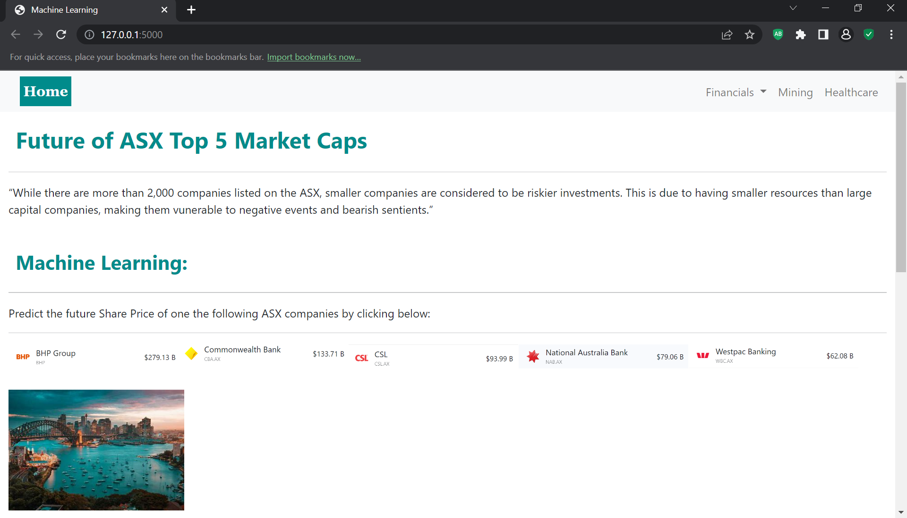

# Demystifying-ML

Project title: Share Price Machine Learning

An interactive website that performs machine learning to predict the future share price of Top 5 Market Caps on the ASX.

To run this application from Visual Studio Code navigate to the shares folder and type "python app.py"

20 years data in CSV format:
[Yahoo Finance Share Price Information](shares/static/data)
Jupyter Notebook workings:
[Machine learning models](./shares/ipynb_model_workings)
Websites HTML templates and CSS for Homepage (Index) and each company
[HTML templates](./shares/templates)
[CSS](./shares/static/css)
Javascript Scatterplot of Interest rates/CPI and Share Prices
[Scatterplot javascript](./shares/static/js)

Performed an ETL process and loaded the data to a MongoDb.

Our dataset contained over 20 years rows of daily trading data for each ASX listed company. The machine learning models considered was LSTM, neural networks, and GridsearchCV, Categorical and Sequential Models. The model with the greatest accuracy was LSTM and consequently used. 

Albert Einstein said “Memory is deceptive because it is coloured by today’s events.”

Long Short-Term Memory (LSTM) networks are a type of "recurrent neural network" capable of learning order dependence in sequence prediction problems. This is a behavior required in complex problem domains like machine translation, speech recognition, and more. We performed the machine learning on each company in jupyter notebook and saved the Model into a file. This saved model was used in the web application to predict the price for a number of days(user input). 

Each company page provides general information, a graph of the model, an input form and an interactive table. 

The Random Forest Regression analysis, considering the impact of recent interest rate hikes and inflation on CBA

link to the presentation slides:
[PresentationSlides](./MACHINE%20LEARNING.pptx)

link to AWS website(Although working previously not working at the moment): 
[AWS website]('http://ec2-54-79-61-102.ap-southeast-2.compute.amazonaws.com:5000")
